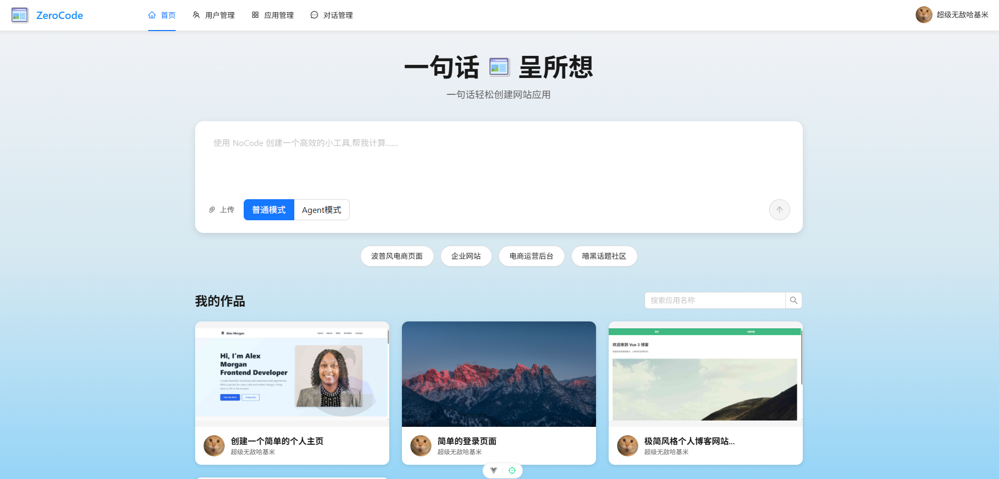

## ZeroCode System

ZeroCode System 是一个 **AI 驱动的代码生成与应用搭建平台**，支持根据自然语言需求，一键生成前端项目（包括单页 HTML、多文件项目、Vue 项目等），并提供在线预览、部署与下载能力。

后端基于 Spring Boot + LangChain4j + LangGraph4j，前端基于 Vue 3 + Vite + TypeScript，整体定位为「AI 辅助开发者快速搭建应用和页面」的系统。




---

## 1. 项目部署与运行步骤

### 1.1 环境准备

- **JDK**：建议使用 **JDK 21**
- **构建工具**：Maven 3.9+（项目已提供 Maven Wrapper，可直接使用 `mvnw`/`mvnw.cmd`）
- **数据库**：MySQL（建议 8.x）
- **缓存 / 会话**：Redis
- **Node.js**：建议 Node.js 18+（用于前端项目）

#### 创建数据库

```sql
CREATE DATABASE ai_code_shadow CHARACTER SET utf8mb4 COLLATE utf8mb4_unicode_ci;
```

### 1.2 配置后端

后端配置位于 `src/main/resources`：

- `application.yml`：主配置文件，包含公共配置、激活的 Profile 等
- `application-dev.yml`：开发环境配置（数据库、Redis、AI Key、COS 等）
- `application-sample.yml`：示例环境配置（数据库、Redis、AI Key、COS 等）

需要根据实际环境修改（以下为说明，**请勿在仓库中提交真实密钥**）：

- **数据库配置**：`spring.datasource.*`
- **Redis 配置**：`spring.data.redis.*`
- **AI / LLM 相关配置**：
  - DeepSeek / OpenAI 兼容接口（经 LangChain4j 配置）
  - 阿里云 DashScope：`dashscope.api-key`
- **对象存储（腾讯云 COS）**：`cos.client.*`

> 建议将敏感信息通过环境变量或独立的本地配置文件注入，避免泄露到代码仓库。

### 1.3 启动后端服务

在项目根目录 `shadow-ai-code-system` 执行：

```bash
# 开发模式运行（推荐）
mvn spring-boot:run

# 或：打包后运行
mvn clean package -DskipTests
java -jar target/ai-coding-system-0.0.1-SNAPSHOT.jar
```

默认配置下：

- 服务端口：`8123`
- 上下文路径：`/api`
- API 文档（Knife4j）：`http://localhost:8123/api/doc.html`

### 1.4 配置并启动前端

前端项目位于 `ai-code-system-frontend` 目录，基于 Vue 3 + Vite + TypeScript。

```bash
cd ai-code-system-frontend
npm install
npm run dev
```

前端通过 Vite 代理 `/api` 请求到后端 `http://localhost:8123`，相关配置通常在：

- `.env` / `.env.development`：例如
  - `VITE_APP_API_BASE=/api`
  - `VITE_APP_DEPLOY_DOMAIN=...`
  - `VITE_APP_PREVIEW_DOMAIN=...`
\

---

## 2. 项目结构

### 2.1 整体目录结构

```text
shadow-ai-code-system/
├── ai-code-system-frontend/          # 前端项目（Vue 3 + Vite + TS）
│   ├── index.html                    # 前端入口 HTML
│   ├── src/
│   │   ├── api/                      # 后端 API 封装
│   │   ├── components/               # 通用组件
│   │   ├── layout/                   # 页面布局
│   │   ├── pages/                    # 业务页面（admin/app/user 等）
│   │   ├── router/                   # 路由配置
│   │   ├── stores/                   # Pinia 状态管理
│   │   ├── access/                   # 权限校验逻辑
│   │   └── utils/                    # 通用工具函数
│   └── package.json
│
├── src/main/java/com/shadow/aicodingsystem/
│   ├── ai/                           # AI 生成核心模块
│   │   ├── guardrail/                # AI 输入、输出护栏（Guardrail）
│   │   ├── model/                    # AI 消息、模型配置等
│   │   └── tools/                    # AI 辅助工具（代码写入、文件处理等）
│   ├── annotation/                   # 自定义注解（如权限校验 AuthCheck）
│   ├── aop/                          # AOP 切面（权限、日志等）
│   ├── config/                       # Spring/第三方组件配置
│   ├── constant/                     # 全局常量
│   ├── controller/                   # Web 层（REST Controller）
│   ├── core/                         # 代码生成门面、构建器、统一入口
│   ├── exception/                    # 自定义异常 & 全局异常处理
│   ├── langgraph4j/                  # LangGraph4j 工作流节点/编排
│   ├── manager/                      # 外部服务管理（如 COS 管理器）
│   ├── mapper/                       # MyBatis-Flex Mapper 接口
│   ├── model/                        # Entity / DTO / VO / Enum
│   ├── ratelimter/                   # 限流组件（基于 Redisson）
│   ├── service/                      # 业务服务层
│   └── utils/                        # 工具类
│
└── src/main/resources/
    ├── application.yml               # 主配置
    ├── application-dev.yml           # 开发环境配置
    ├── mapper/                       # MyBatis XML 映射
    └── prompt/                       # AI 提示词模板（Prompt）
```

### 2.2 关键类与入口

- **应用启动类**：`com.shadow.aicodingsystem.AiCodingSystemApplication`
- **控制层示例**：`controller.AppController`、`controller.UserController`、
  `controller.ChatHistoryController`、`controller.WorkflowSseController` 等
- **代码生成门面**：`core.AiCodeGeneratorFacade`（封装多类型代码生成逻辑）
- **AI 工作流**：`langgraph4j` 包中定义了 AI 生成流程的节点与编排

---

## 3. 项目架构图（文字说明）

整体上遵循经典的 **前后端分离 + 分层架构**，并在服务层集成了 AI 工作流与外部服务：

```text
┌─────────────────────────────────────────────────────────────┐
│                         前端（Web）                         │
│  - Vue 3 + Vite + TypeScript + Ant Design Vue               │
│  - 页面：应用广场、应用详情、AI 对话、用户中心、后台管理等     │
└─────────────────────────────────────────────────────────────┘
                              │
                              │ HTTP / SSE（通过 /api 代理）
                              ▼
┌─────────────────────────────────────────────────────────────┐
│                       控制层（Controller）                  │
│  - AppController / UserController / ChatHistoryController   │
│  - WorkflowSseController（工作流流式响应）                  │
│  - HealthController / StaticResourceController 等           │
└─────────────────────────────────────────────────────────────┘
                              │
                              │（AOP：权限校验、限流拦截）
                              ▼
┌─────────────────────────────────────────────────────────────┐
│                        服务层（Service）                    │
│  - 用户服务：UserService                                    │
│  - 应用服务：AppService                                     │
│  - 聊天/历史：ChatHistoryService                            │
│  - 代码生成：AiCodeGeneratorFacade + 具体生成 Service       │
│  - 部署/下载：ProjectDownloadService、ScreenshotService 等   │
└─────────────────────────────────────────────────────────────┘
          │                           │                   │
          ▼                           ▼                   ▼
┌─────────────────────┐   ┌──────────────────────┐  ┌──────────────────────┐
│ AI & 工作流模块     │   │ 持久层（Repository）   │  │ 外部服务 / 第三方接口 │
│ - LangChain4j       │   │ - MyBatis-Flex Mapper │  │ - 腾讯云 COS         │
│ - LangGraph4j       │   │ - MySQL               │  │ - 阿里云 DashScope   │
│ - DeepSeek / Qwen   │   └──────────────────────┘  │ - Pexels 图片服务     │
│ - Redis Chat Memory │                             │ - Selenium 截图      │
└─────────────────────┘                             └──────────────────────┘
```

**说明：**

- 前端通过 `/api` 与后端交互，部分接口采用 **SSE 流式返回**（例如长时间的 AI 生成任务）。
- 控制层通过注解 + AOP 完成 **权限控制**、**限流** 等横切逻辑。
- 服务层使用 **LangChain4j + LangGraph4j** 将 AI 模型、Prompt、工作流节点组织起来，实现**多步骤代码生成与质量校验**。
- 持久层采用 **MyBatis-Flex** 访问 MySQL，管理用户、应用、聊天记录等数据。
- 外部服务包括：腾讯云 COS（文件/静态资源）、阿里云 DashScope（图像/模型）、Pexels 图片、Selenium 网页截图等。

---

## 4. 项目功能模块

### 4.1 用户与权限模块

- 用户注册、登录、登出、个人信息管理
- 角色划分：普通用户 `user`、管理员 `admin`
- 基于 Spring Session + Redis 进行会话管理
- 使用自定义注解（如 `@AuthCheck`）与 AOP 切面实现权限控制

### 4.2 应用管理模块

- 创建、编辑、删除应用（如一个「代码生成应用」）
- 支持按名称、创建者等条件分页查询
- 支持设置应用优先级、封面图、初始 Prompt 等信息
- 管理端具备完整增删改查能力

### 4.3 AI 代码生成模块

- 支持多种代码生成类型：
  - 单文件 HTML 页面
  - 多文件前端项目
  - Vue 前端项目（`VUE_PROJECT`）
  - 其他扩展类型
- 通过 `AiCodeGenTypeRoutingService` 进行 **智能路由**，根据用户描述与上下文选择合适的生成类型
- 使用 LangChain4j 封装对接 DeepSeek 等模型，结合 Prompt 模板实现稳定输出
- 输出结果可直接写入本地目录，支持后续预览与部署

### 4.4 聊天与历史记录模块

- 以应用为单位进行聊天对话，记录用户与 AI 的消息
- 使用 Redis Chat Memory 或自定义记忆机制维持会话上下文
- 历史消息可按应用、用户查询，支持前端加载展示

### 4.5 工作流（LangGraph4j）模块

- 使用 LangGraph4j 定义多节点工作流，例如：
  - 收集用户需求 & 辅助截图/图片
  - Prompt 增强与结构化
  - 路由到对应代码生成链路
  - 执行代码生成、质量检查
  - 构建应用项目结构
- 工作流执行过程支持 **Flux / SSE 流式输出**，前端可实时展示进度和阶段结果

### 4.6 部署与下载模块

- 将生成的前端项目输出到本地指定目录：
  - 代码输出目录：`tmp/code_output/...`
  - 部署目录：`tmp/code_deploy/...`
- 支持打包为 zip 供用户下载
- 支持通过静态资源服务器/前端项目进行预览

### 4.7 静态资源与截图模块

- 通过腾讯云 COS 存储图片、封面、静态资源等
- 集成 Selenium + WebDriverManager，对生成的页面进行自动截图
- 可用于生成预览图、缩略图等

### 4.8 限流与稳定性模块

- 使用 Redisson 实现注解式限流，例如：
  - 限制单用户在单位时间内的生成次数
  - 对高消耗接口（如 AI 生成）进行保护
- 配合缓存和日志记录，保证系统稳定性与可观测性

---

## 5. 技术选型

### 5.1 后端技术栈

- **基础框架**
  - Spring Boot 3.5.9
  - Spring Web
  - Spring AOP
  - Spring Session（基于 Redis）
- **持久化**
  - MyBatis-Flex 1.11.0
  - HikariCP 连接池
  - MySQL
- **AI / LLM**
  - LangChain4j 1.11.0-SNAPSHOT
  - LangGraph4j 1.6.0-rc2
  - DeepSeek / 通义千问（Qwen）（通过 OpenAI/DashScope 接口）
  - 阿里云 DashScope 2.21.1（图像/多模态等）
- **缓存与限流**
  - Redis
  - Caffeine 本地缓存
  - Redisson 3.50.0（分布式锁、限流）
- **对象存储 & 外部服务**
  - 腾讯云 COS SDK 5.6.227
  - Pexels 图片 API
  - Selenium 4.33.0 + WebDriverManager 6.1.0（网页截图）
- **文档与工具**
  - Knife4j 4.4.0（基于 OpenAPI 3 的接口文档）
  - Lombok
  - Hutool 5.8.38（工具库）

### 5.2 前端技术栈

- Vue 3.5
- Vite 6.4
- TypeScript 5.8
- Ant Design Vue 4.2
- Pinia 3（状态管理）
- Vue Router
- Axios（请求封装）
- Markdown-it、Highlight.js（文档/代码高亮等）

---
